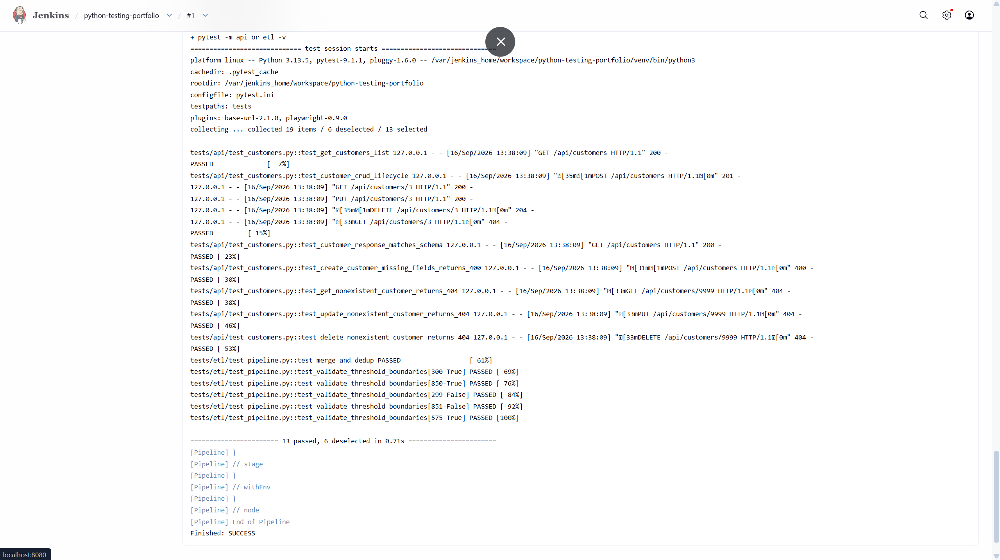

# Python + PyTest Testing Portfolio


A single self-contained project demonstrating UI, API, and ETL/data-pipeline
testing with **Python and PyTest only** — built to close a specific gap:
Python/PyTest keeps showing up across QA/SDET job descriptions in Ireland,
separately from the Java/Selenium framework in my other repo.

## Why a self-built system under test

Rather than testing third-party public sites, this repo includes its own
small system under test (`mock_target/`) — a Flask app with a login page
and a customers API, plus a CSV-based ETL pipeline with a dedupe and
credit-score threshold validation step. That ETL logic mirrors real work
from my time at Cognizant (ETL/data pipeline validation, ~99% data
integrity) and TransUnion (regression coverage across UI/API/ETL) —
translated out of the enterprise ETL GUI (Ab Initio / Express>It) I used
on the job, into plain pandas + PyTest, so the reasoning is visible and
testable on its own.

## How each module maps to real experience

| Module | What it tests | Maps to |
|---|---|---|
| `tests/ui/` | Login form: valid/invalid credentials, dynamic waits instead of fixed sleeps, Page Object Model | TransUnion — UI automation frameworks, ~30% regression coverage improvement |
| `tests/api/` | Full CRUD lifecycle, JSON schema validation, negative-path/error-code handling | TransUnion — API/DB validation with REST Assured & Postman; SQL testing at both TransUnion and Cognizant |
| `tests/etl/` | Dedupe by normalized email, credit-score threshold validation with boundary cases | Cognizant — ETL/data pipeline validation (~99% data integrity); TransUnion — data validation across enterprise products, done here in pandas instead of Ab Initio/Express>It |
| `Jenkinsfile` + local Jenkins | API + ETL suites run automatically on a local Jenkins pipeline | TransUnion — CI/CD integration via Jenkins, ~20% release cycle time reduction |
| `.github/workflows/tests.yml` | Full 19-test suite (UI + API + ETL) on every push, cloud-hosted | Same CI discipline, scoped to run publicly and cover everything including the browser-dependent UI suite |

## Continuous integration

Two CI pipelines, deliberately scoped differently:

- **GitHub Actions** (badge above) runs the complete suite — all 19 tests,
  including the Playwright UI tests — on a clean cloud VM on every push.
  This is the one anyone can verify by clicking the badge.
- **Jenkins**, run locally via Docker rather than publicly hosted (a
  public Jenkins instance is a real security exposure, and it isn't
  needed to make the point). Scoped to the API and ETL suites — lighter
  weight than installing a full browser stack inside the container — and
  chosen specifically because Jenkins is the CI tool actually listed on
  my resume and used at TransUnion, not just a generic choice.

  

  Jenkins isn't webhook-triggered like GitHub Actions, since that would require
  exposing a local instance to the public internet — instead it polls GitHub
  every 5 minutes for new commits (`H/5 * * * *`) and triggers itself. Slightly
  slower than an instant webhook, but keeps the "local-only" decision intact
  without giving up automatic runs.

## Structure

mock_target/
  app.py                # Flask app: login page (UI target) + /api/customers (API target)
  templates/login.html
  etl/pipeline.py        # ETL target: load -> merge -> dedupe -> threshold validate
  data/                  # mock upstream extracts with overlapping/dirty records
tests/
  conftest.py            # shared fixtures (app_base_url) available to ui/api/etl
  ui/    # pytest-playwright tests against the login page (Page Object Model)
  api/   # pytest + requests tests against /api/customers
  etl/   # pytest + pandas tests against pipeline.py functions
Dockerfile                        # Jenkins LTS image + Python, for the local pipeline
Jenkinsfile                       # local Jenkins pipeline: install deps, run API+ETL suites
.github/workflows/tests.yml       # GitHub Actions: full suite on every push

## Status

- [x] Sprint 0 — repo scaffold + self-built UI/API/ETL targets
- [x] Sprint 1 — UI test suite (pytest-playwright): Page Object Model, login/form
      tests, dynamic-wait tests — 6/6 passing
- [x] Sprint 2 — API test suite (requests): CRUD lifecycle, schema validation,
      negative-path tests — 7/7 passing
- [x] Sprint 3 — ETL test suite (pandas): dedupe/threshold logic, fixtures,
      parametrized boundary tests — 6/6 passing. Directly answers interview
      feedback on demonstrating data-validation reasoning independent of an
      enterprise ETL GUI
- [x] Sprint 4 — shared fixtures, GitHub Actions CI (cloud, full suite), local
      Jenkins CI (API + ETL), final docs — 19/19 passing overall

## Running it

```bash
pip install -r requirements.txt
playwright install                 # one-time browser download for UI tests
python mock_target/app.py          # serves the UI/API target on :5000 — leave running
pytest                             # full suite (needs the Flask app running above)
pytest -m ui                       # UI suite only
pytest -m api                      # API suite only
pytest -m etl                      # ETL suite only — no Flask app needed
```